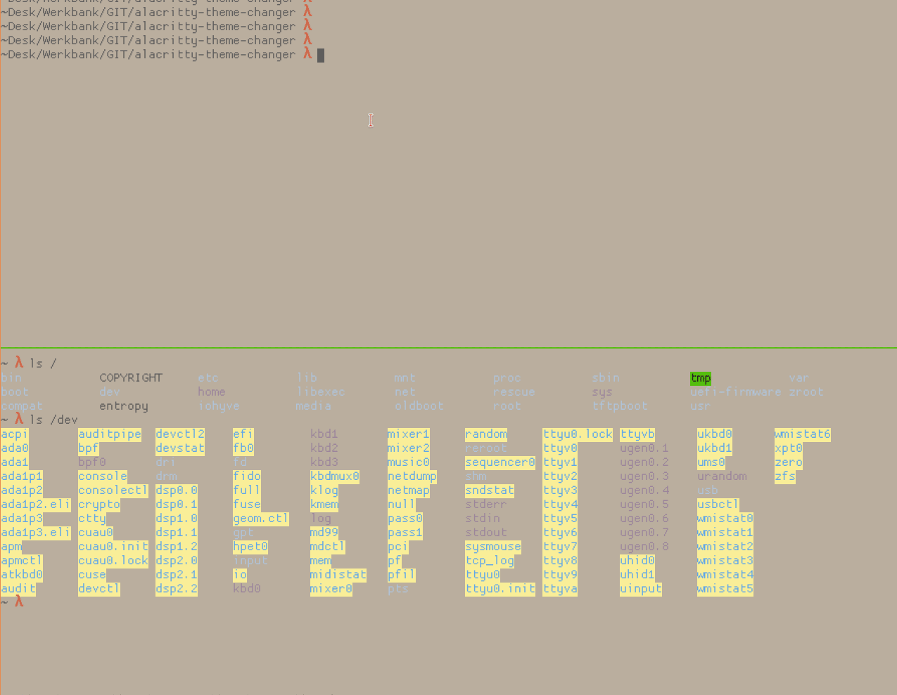

# alacritty-theme-changer
Change alacritty terminal theme on the fly 

# Perl Dependecies.

```bash
pkg install p5-File-Touch-0.12
pkg install p5-Term-Choose-1.731
```

# Install

Download or clone [alacritty-theme](https://github.com/rajasegar/alacritty-theme).   
Copy the directory `themes` to `$HOME/.config/alacritty/`   
Download or clone this Repo  

Edit your [alacritty](https://github.com/alacritty/alacritty) config and add   

```yaml
import:
- ~/.config/alacritty/themes/default.yml
```
remove or comment out the `colors` block.   

And make sure it contains the line: 

```yaml
live_config_reload: true
```


Copy `crittheme` from this repo into `$PATH` e.g `~/bin`


# Showcase


